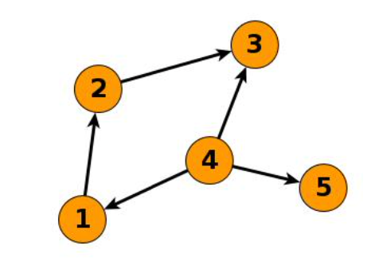

# ML-social-network-project (COMP90051 Statistical Machine Learning – 2020 Sem2)

### Overview
Pairwise relationships are prevalent in real life. For example, friendships between people, communication links between computers and pairwise similarity of images. Networks provide a way to represent a group of relationships. The entities in question are represented as network nodes and the pairwise relations as edges.  
In network data, there are often missing edges between nodes. This can be due to a bug or deficiency in the data collection process, a lack of resources to collect all pairwise relations or simply there is uncertainty about those relationships. Analysis performed on incomplete networks with missing edges can bias the final output, e.g., if we want to find the shortest path between two cities in a road network, but we are missing information of major highways between these cities, then no algorithm will able to find this actual shortest path.  
Furthermore, we might want to predict if an edge will form between two nodes in the future. For example, in disease transmission networks, if health authorities determine a high likelihood of a transmission edge forming between an infected and uninfected person, then the authorities might wish to vaccinate the uninfected person.  
In this way, being able to predict and correct for missing edges is an important task.

### Project Specification
In this project, we are learning from a training network and trying to predict whether edges exist among test node pairs.  
The training network is a partial crawl of the Twitter social network from several years ago. The nodes in the network—Twitter users—have been given randomly assigned IDs, and a directed edge from node A to B represents that user A follows B. The training network is a subgraph of the entire network. Starting from several random seed nodes, we proceeded to obtain the friends of the seeds, then their friends’ friends, and so on for several iterations.  
The test data is a list of 2,000 edges, and our task is to predict if each of those test edges are really edges in the Twitter network or are fake ones. 1,000 of these test edges are real and withheld from the training network, while the other 1,000 do not actually exist.

### Data Format
All data will be available in raw text. The training graph data will given in a (tab delimited) edge list format, where each row represents a node and its out neighbours. For example:  
1 2  
2 3  
4 3 5 1  
represents the network illustrated in the figure below.

The test edge set is in a (tab-delimited) edge list format, where each represents an edge (source node, target node). Given this 2,000-row edge list, our implemented algorithm should take the test list in and return a 2,001 row CSV file that has a) in the first row, the string “Id,Predicted”; b) in all subsequent rows, a consecutive integer ID a comma then a float in the range [0,1]. These floats are “guesses” or predictions as to whether the corresponding test edge was from the Twitter network or not. Higher predictions correspond to being more confident that the edge is real.  
For example, given the test edge set of {(3, 1), (3, 4)} as represented in CSV format by  
Id,Source,Sink  
1,3,1  
2,3,4  
if your prediction probabilities are 0.1 for edge (3,1), 0.99 for edge (3,4), then your output file should be:  
Id,Predicted  
1,0.1   
2,0.99 

The test set will be used to generate an area under ROC curve (AUC) for performance

Notes: DataGeneration.py generates data from train.txt in the form of source, sink and link probability.
CombineCSV.py combines CSV files by Python pandas. 
main.ipynb contains codes and brief description of methodology we used for link prediction.
